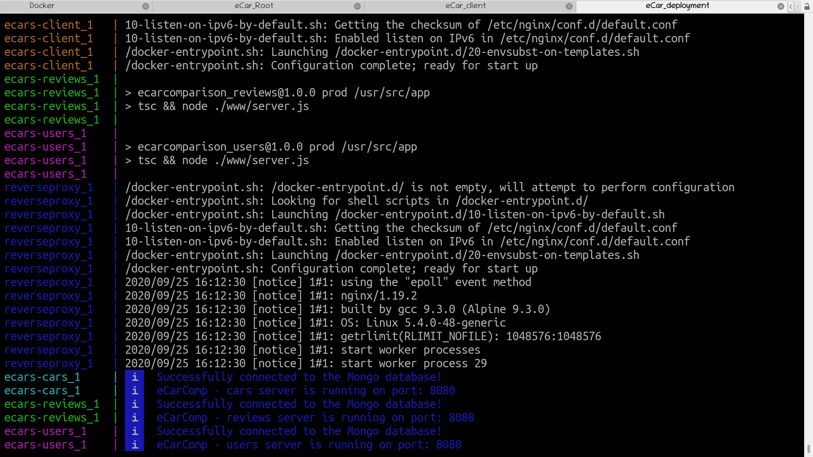
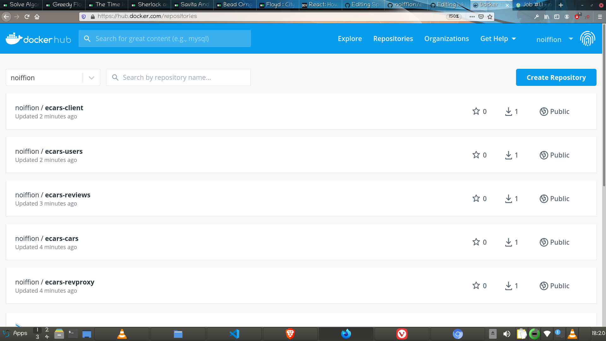

# eCarComparison

[](https://github.com/noiffion/eCarComparison/blob/main/LICENSE)
[](https://travis-ci.com/github/noiffion/eCarComparison)
[](https://github.com/prettier/prettier)

## The application

<div align="center">
  
</div>

eCar comparison is a microservice based web application developed as the capstone project of the Udacity Cloud Engineering Nanodegree. It allows users to register and log into a web client, upload a photo of themselves (using signed urls provided by aws S3) post new reviews, and update or delete previous ones about a car, rate other users' reviews and compare the details of two cars of their choice.

<div align="center">
  
</div>


The repo of the project is split into five parts:
1. [Front end](/client): A React client bootsrapped with [Create React App](https://create-react-app.dev/docs/adding-typescript/).
2. [Cars](/cars): Node-Express microservice -> getting images and details of cars.
3. [Reviews](/reviews): Node-Express microservice -> CRUD reviews about cars.
4. [Users](/users): Node-Express microservice -> manage authentication and sign in / sign up.
5. [Reverse proxy](/deployment): reverse-proxy -> configuration settings of Nginx, Docker, Kubernetes.

<div align="center">
  
</div>

### Prerequisites to install the app locally

  1) Node (LTS version) and Node Package Manager (NPM). Before continuing, you must download and install Node (NPM is included) from [https://nodejs.com/en/download](https://nodejs.org/en/download/).
  2) The Ionic Command Line Interface. Instructions for installing the CLI can be found in the [Ionic Framework Docs](https://ionicframework.com/docs/installation/cli).
  3) Database: Create a MongoDB database on Mongo Atlas. Set values for shell / environment variables (prefixed with DB_).
  4) S3 Create an AWS S3 bucket. Set values for shell / environment (prefixed with AWS_).
  5) Environment variables mentioned above will need to be set in deployment/docker/.env. These environment variables include database and S3 connection details. (See 'Setup Docker Environment' section).


<div align="center">
  
</div>

***

## Travis
### Set up Travis
The CI tool used for the project is TravisCI (you need to connect your repo to Travis on its website).
Add .travis.yml file with the appropriate settings (after each commit to the 'main' branch a build process starts automatically).

<div align="center">
  
</div>

***

## Docker
### Set up Docker Environment

You'll need to install [Docker](https://docs.docker.com/install/). Open a new terminal within the project directory (in the 'deployment' folder):

```
cd deployment/docker
```
The following shell variables need to be set (in an .env file in the folder above with the appropriate values):
```
PORT=
DB_UNAME=
DB_PWD=
DB_PATH=
AWS_BUCKET=
AWS_REGION=
AWS_PROFILE=
AWS_ACCESS_KEY=
AWS_SECRET_KEY=
JWT_KEY=
```
Build the images:
```
docker-compose -f docker-compose-build.yaml build --parallel
```
Push the images:
```
docker logout
docker login
docker-compose -f docker-compose-build.yaml push
```
Run the containers:
```
docker-compose up
```
<div align="center">
  
</div>

After that you should open a browser at http://localhost:3003/

Stop the containers:
```
docker-compose stop
```

On a Linux system each of the docker commands above should be run as root (e.g. sudo docker-compose up).

The public [DockerHub](https://hub.docker.com/u/noiffion) images:
- [Client](https://hub.docker.com/repository/docker/noiffion/ecars-client)
- [Cars](https://hub.docker.com/repository/docker/noiffion/ecars-cars)
- [Reviews](https://hub.docker.com/repository/docker/noiffion/ecars-reviews)
- [Users](https://hub.docker.com/repository/docker/noiffion/ecars-users)
- [Reverse proxy](https://hub.docker.com/repository/docker/noiffion/ecars-revproxy)

<div align="center">
  
</div>

***

## Kubernetes
### Deploy to Kubernetes cluster

You'll need to set up an [EKS cluster](https://docs.aws.amazon.com/eks/latest/userguide/clusters.html) and a corresponding node group.

You'll need to install [kubectl](https://kubernetes.io/docs/tasks/tools/install-kubectl/) and [AWS CLI](https://docs.aws.amazon.com/cli/latest/userguide/cli-chap-install.html).
An EKS cluster with proper node groups must be set up on AWS.

Connect the kubernetes cluster created on AWS to kubectl:
```
aws eks --region <aws-region> update-kubeconfig --name <project_name>
```

Set the correct values in env-secret.yaml and env-configmap.yaml files.
Go to the 'deployment/k8s' folder and run the commands below in the following order.
```
kubectl apply -f env-secret.yaml
kubectl apply -f env-configmap.yaml

kubectl apply -f frontend-deployment.yaml
kubectl apply -f frontend-service.yaml

kubectl apply -f backend-feed-deployment.yaml
kubectl apply -f backend-feed-service.yaml

kubectl apply -f backend-user-deployment.yaml
kubectl apply -f backend-user-service.yaml

kubectl apply -f reverseproxy-deployment.yaml
kubectl apply -f reverseproxy-service.yaml
```

Verify that every container has been deployed correctly, the services have been set up and all pods are running:
```
kubectl get all
```

Cloudwatch!!!

***

### Built with:

Front end:
- [Create React App](https://github.com/facebook/create-react-app)
- [Zendeskgarden](https://github.com/zendeskgarden/react-components)
- [React Router](https://github.com/ReactTraining/react-router)
- [Styled Components](https://github.com/styled-components/styled-components)
- [Moment](https://github.com/moment/moment/)

Back end:
- [Express](https://github.com/expressjs/express)
- [Mongoose](https://github.com/Automattic/mongoose)
- [Nodemon](https://github.com/remy/nodemon)
- [Bcrypt](https://github.com/kelektiv/node.bcrypt.js)
- [JSON Web Token](https://github.com/auth0/node-jsonwebtoken)
- [AWS SDK](https://github.com/aws/aws-sdk-js)
- [Cors](https://github.com/expressjs/cors)
- [Dotenv](https://github.com/motdotla/dotenv)

Full stack:
- [TypeScript](https://github.com/microsoft/TypeScript)
- [Prettier](https://github.com/prettier/prettier)
- [ESLint](https://github.com/eslint/eslint)
